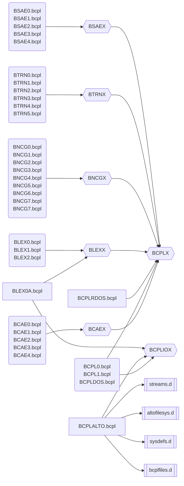

Sources for BCPL compiler
=========================

- http://www.bitsavers.org/pdf/xerox/alto/bcpl/BCPL_Reference_Manual_Sep75.pdf
- http://www.bitsavers.org/pdf/xerox/alto/bcpl/AltoBCPLdoc.pdf

## Components of software
- CAE. BCAEX and BCAEx.bcpl files
- BCPL Alto-specific functions - BCPLALTO.bcpl
- Lexer. BLEXX and BLEXx.bcpl files
- Nova Code Generator. BNCGX and BNCGx.bcpl files
- BSAEX and BSAEx.bcpl files
- Translator. BTRNX and BTRNx.bcpl

## Files of sofware
| File | Component | 
| - | - |
| [BCAE0.bcpl](BCAE0.bcpl) | BCPL Compiler -- CAE Main Program. |
| [BCAE1.bcpl](BCAE1.bcpl) | BCPL Compiler -- CAE Part 1. |
| [BCAE2.bcpl](BCAE2.bcpl) | BCPL Compiler -- Part 2 of CAE. |
| [BCAE3.bcpl](BCAE3.bcpl) | BCPL Compiler -- Part 3 of CAE. |
| [BCAE4.bcpl](BCAE4.bcpl) | BCPL Compiler -- Part 4 of CAE. |
| [BCAEX](BCAEX) | Declarations for the BCPL Compiler -- CAE. |
| [BCPL0.bcpl](BCPL0.bcpl) | BCPL Main program. |
| [BCPL1.bcpl](BCPL1.bcpl) | BCPL Compiler -- IO routines. |
| [BCPLALTO.bcpl](BCPLALTO.bcpl) | BCPL Alto-specific functions. |
| [BCPLD.asm](BCPLD.asm) | BCPLD. *Debugger?* |
| [BCPLDOS.bcpl](BCPLDOS.bcpl) | BCPL DOS-specific functions |
| [BCPLIOX](BCPLIOX) | BCPL Compiler-- io definitions |
| [BCPLRDOS.bcpl](BCPLRDOS.bcpl) | BCPL RDOS-specific functions |
| [BCPLX](BCPLX) | Declarations for the BCPL Compiler, used throughout the Compiler. |
| [BLEX0.bcpl](BLEX0.bcpl) | BCPL Compiler -- Lexical Analyzer,Main Program |
| [BLEX0A.bcpl](BLEX0A.bcpl) | BCPL Compiler -- *DCS* Precompiled Declaration Files -- Read, Write Utilities |
| [BLEX1.bcpl](BLEX1.bcpl) | BCPL Compiler -- Lexical Analyzer, Part 1. |
| [BLEX2.bcpl](BLEX2.bcpl) | BCPL Complier -- Lexical Analyzer,part 2 |
| [BLEXX](BLEXX) | BCPL Compiler -- Declarations for the Lexical Analyzer. |
| [BNCG0.bcpl](BNCG0.bcpl) | BCPL Compiler -- Nova Code Generator, Main program. |
| [BNCG1.bcpl](BNCG1.bcpl) | BCPL Compiler -- Nova Code Generator, Impure stream processor. |
| [BNCG2.bcpl](BNCG2.bcpl) | BCPL Compiler -- Nova Code Generator, Pure stream processor. |
| [BNCG3.bcpl](BNCG3.bcpl) | BCPL Compiler -- Nova Code Generator, Stack and Register maintainance routines. |
| [BNCG4.bcpl](BNCG4.bcpl) | BCPL Compiler -- Nova Code Generator, Instruction generation routines. |
| [BNCG5.bcpl](BNCG5.bcpl) | BCPL Compiler -- Nova Code Generator, Instruction generation routines. |
| [BNCG6.bcpl](BNCG6.bcpl) | BCPL Compiler -- Nova Code Generator, Instruction generation routines. |
| [BNCG7.bcpl](BNCG7.bcpl) | BCPL Compiler -- Nova Code Generator, More CG routines. |
| [BNCG8.bcpl](BNCG8.bcpl) | BCPL Compiler -- Nova Code Generator, NCG part 8 -- Qualifier Ocode items. |
| [BNCGX](BNCGX) | BCPL Compiler -- Nova Code Generator Declarations. |
| [BSAE0.bcpl](BSAE0.bcpl) | BCPL Compiler -- SAE Main Program. |
| [BSAE1.bcpl](BSAE1.bcpl) | BCPL Compiler -- SAE part 1 - Declaration handling. |
| [BSAE2.bcpl](BSAE2.bcpl) | BCPL Compiler -- SAE part 2 - More Declaration handling. |
| [BSAE3.bcpl](BSAE3.bcpl) | BCPL Compiler -- SAE Part 3 - Expression scanning. |
| [BSAE4.bcpl](BSAE4.bcpl) | BCPL Compiler -- SAE part 4 -- Structure reference handling. |
| [BSAEX](BSAEX) | Declarations for the BCPL Compiler -- SAE. |
| [BTRN0.bcpl](BTRN0.bcpl) | BCPL Compiler -- Trans, Main Program. |
| [BTRN1.bcpl](BTRN1.bcpl) | BCPL Compiler -- Trans, Part 1. |
| [BTRN2.bcpl](BTRN2.bcpl) | BCPL Compiler -- Trans, Part 2. |
| [BTRN3.bcpl](BTRN3.bcpl) | BCPL Compiler -- Trans, Part 3. |
| [BTRN4.bcpl](BTRN4.bcpl) | BCPL Compiler -- Part 4 of Trans. |
| [BTRN5.bcpl](BTRN5.bcpl) | BCPL Compiler -- Part 5 of Trans. |
| [BTRNX](BTRNX) | Declarations for the BCPL Compiler -- Trans. |
| [BUTIL.asm](BUTIL.asm) | ??? |

## Files dependency

